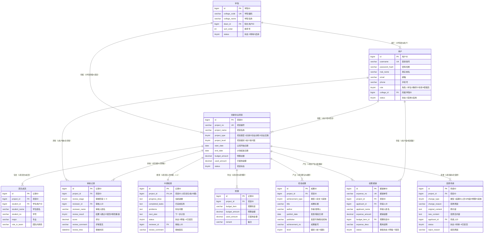

# 系统总体E-R图（Mermaid erDiagram 代码）
# 使用方法：复制下方 erDiagram 代码块到任意 Mermaid 在线编辑器即可渲染
# 实体数量：10；关系数量：12（简化版）

```mermaid
erDiagram
    %% ==================== 实体定义（10个，与数据库表严格对应） ====================
    学院 {
        bigint id PK "学院ID"
        varchar college_code UK "学院编码"
        varchar college_name "学院名称"
        bigint dean_id FK "院长用户ID"
        int sort_order "排序号"
        tinyint status "状态 0停用/1启用"
    }

    用户 {
        bigint id PK "用户ID"
        varchar username UK "登录账号"
        varchar password_hash "密码哈希"
        varchar real_name "真实姓名"
        varchar email "邮箱"
        varchar phone "手机号"
        tinyint role "角色 1学生/2教师/3专家/4管理员"
        bigint college_id FK "所属学院ID"
        tinyint status "状态 0禁用/1启用"
    }

    创新创业项目 {
        bigint id PK "项目ID"
        varchar project_no UK "项目编号"
        varchar project_name "项目名称"
        tinyint project_type "项目类型 1创新/2创业训练/3创业实践"
        tinyint project_level "项目级别 1校/2省/3国"
        date start_date "立项开始日期"
        date end_date "计划结束日期"
        decimal budget_amount "预算总额"
        decimal used_amount "已使用金额"
        tinyint status "项目状态"
    }

    团队成员 {
        bigint id PK "记录ID"
        bigint project_id FK "项目ID"
        bigint student_id FK "学生用户ID"
        varchar student_name "学生姓名"
        varchar student_no "学号"
        varchar major "专业"
        varchar role_in_team "团队内角色"
    }

    审核记录 {
        bigint id PK "记录ID"
        bigint project_id FK "项目ID"
        tinyint review_stage "审核阶段 1~4"
        bigint reviewer_id FK "审核人ID"
        varchar reviewer_name "审核人姓名"
        tinyint review_result "结果 1通过/2驳回/3修改重提"
        decimal score "评分"
        varchar review_comment "评审意见"
        datetime review_time "审核时间"
    }

    预算 {
        bigint id PK "记录ID"
        bigint project_id FK "项目ID"
        varchar budget_item "预算科目"
        decimal budget_amount "预算金额"
        decimal used_amount "已使用金额"
        varchar remark "备注"
    }

    经费报销 {
        bigint id PK "报销单ID"
        varchar expense_no UK "报销单号"
        bigint project_id FK "项目ID"
        bigint applicant_id FK "申请人ID"
        varchar applicant_name "申请人姓名"
        decimal expense_amount "报销金额"
        bigint budget_item_id FK "预算科目ID"
        varchar expense_desc "费用说明"
        tinyint status "审批状态 0草稿~7驳回"
    }

    中期检查 {
        bigint id PK "记录ID"
        bigint project_id FK,UK "项目ID (1项目仅1条中期)"
        text progress_desc "当前进展"
        text completed_tasks "已完成任务"
        text problems "存在问题"
        text next_plan "下一步计划"
        tinyint status "状态 0草稿~4已驳回"
        bigint reviewer_id FK "审核人ID"
        varchar review_comment "审核意见"
    }

    变更申请 {
        bigint id PK "申请ID"
        bigint project_id FK "项目ID"
        tinyint change_type "类型 1延期/2人员/3内容/4预算/5其他"
        varchar change_reason "变更原因"
        text original_content "原内容"
        text new_content "变更后内容"
        bigint applicant_id FK "申请人ID"
        tinyint status "状态 0待审~4已驳回"
        varchar reject_reason "驳回原因"
    }

    项目成果 {
        bigint id PK "成果ID"
        bigint project_id FK "项目ID"
        tinyint achievement_type "类型 1论文~6其他"
        varchar title "成果标题"
        varchar author "作者/发明人"
        date publish_date "发表/授权日期"
        varchar publisher "发表刊物/授权机构"
        varchar achievement_no "成果编号"
        tinyint level "级别 1校~4国际"
    }

    %% ==================== 关系定义（12条，简化版：减少用户连接线，删除冗余） ====================
    %% 基数语法：左实体 左基数|关系名|右基数 右实体
    %% ||  = 1且仅1     }|  = 0或N (N端)
    %% |{  = 1或N (N端)  }o  = 0或1

    %% R1 学院 1 —属于— N 用户
    学院 ||--|{ 用户 : "属于（1学院含N用户）"

    %% R2 学院 1 —申报— N 项目
    学院 ||--|{ 创新创业项目 : "申报（1学院申报N项目）"

    %% R3 用户 1 —创建— N 项目
    用户 ||--|{ 创新创业项目 : "创建（1用户创N项目）"

    %% R4 用户 1 —评审— N 审核记录 【修复原逻辑错误】
    用户 ||--|{ 审核记录 : "评审（1用户做N次评审）"

    %% R5 项目 1 —包含— N 团队成员
    创新创业项目 ||--|{ 团队成员 : "包含（1项目含N成员）"

    %% R6 项目 1 —审核— N 审核记录
    创新创业项目 ||--|{ 审核记录 : "审核（1项目经N次审核）"

    %% R7 项目 1 —检查— 1 中期检查 【1:1两端都是1，用||--||】
    创新创业项目 ||--|| 中期检查 : "检查（1项目仅1次中期，1:1）"

    %% R8 项目 1 —列支— N 预算
    创新创业项目 ||--|{ 预算 : "列支（1项目含N项预算）"

    %% R9 项目 1 —产出— N 项目成果
    创新创业项目 ||--|{ 项目成果 : "产出（1项目登记N成果）"

    %% R10 项目 1 —产生— N 经费报销
    创新创业项目 ||--|{ 经费报销 : "产生（1项目产生N笔报销）"

    %% R11 项目 1 —变更— N 变更申请
    创新创业项目 ||--|{ 变更申请 : "变更（1项目提N次变更）"

    %% R12 用户 1 —申请— N 经费报销
    用户 ||--|{ 经费报销 : "申请（1用户提N笔报销）"
```
